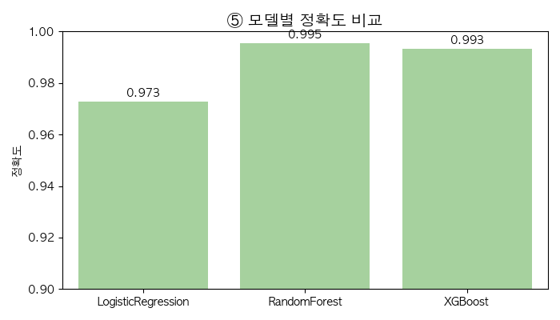
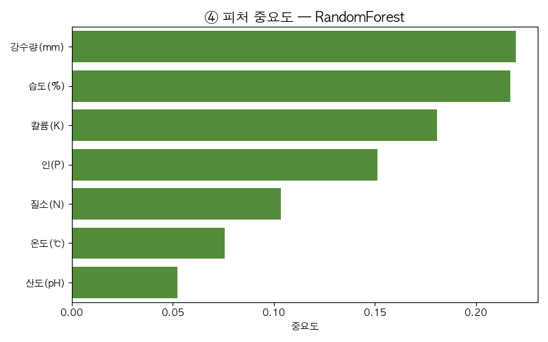
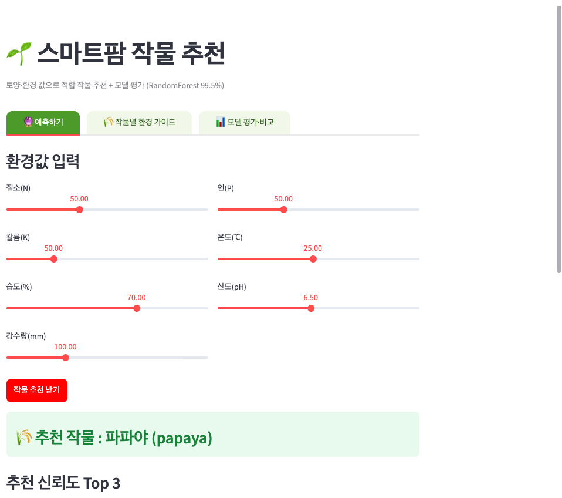

# 🌱 SmartFarm AI — 멀티모달 재배 도우미 (ML → DL → LLM)

> 센서는 *환경 숫자*를 보여주지만, 이 AI는 *작물에 지금 뭘 해줘야 하는지*를 알려준다.
>
> 하나의 도메인(스마트팜)을 **정형(ML) → 이미지(DL) → 언어(LLM)** 멀티모달 3단으로 완주하는 프로젝트.
> 세 단계는 한 레포 안에서 **톱니처럼 물려** 돌지만(데이터·모델 공유), **각 단계는 개별 배포**된다.


[](https://smartfarm-ai.streamlit.app/)


> 🔗 **GitHub:** https://github.com/luma200ok/smartfarm-ai  
> 🚀 **라이브 데모(Phase 1):** https://smartfarm-ai.streamlit.app/

---

## ✨ 주요 기능

<details>
<summary><b>펼쳐 보기</b> — Phase 1 데모가 하는 일</summary>

- 🔮 **작물 추천** — 토양·환경 7개 값 입력 → 적합 작물 22종 중 추천 + 신뢰도 Top3 + 추천 이유
- 🌾 **작물별 환경 가이드** — 작물 선택 → 적합 환경값(평균·최소·최대) 표
- 📊 **모델 평가·비교** — 3종 정확도 · 혼동행렬 · 피처 중요도 · VIF 시각화
- 📑 **자동 EDA 리포트** — `ydata-profiling` 리포트 임베드
- 🧠 **RandomForest 99.5%** — 교차검증(99.55%±0.25%)·GridSearchCV 튜닝 완료, 학습↔서빙 분리(`.pkl`)

</details>

---

## 🔗 단계별 기록 & 라이브 데모

| Phase | 한 일 | 상태 | 평가 지표 | 기록 | 라이브 데모 |
|---|---|---|---|---|---|
| **1 · ML** | 정형 센서 → 작물 추천 분류 (sklearn) | ✅ **완료** | **정확도 99.5%** (+F1·혼동행렬) | [📄 phase1_ml.md](docs/phase1_ml.md) | [🚀 실행](https://smartfarm-ai.streamlit.app/) |
| **2 · DL** | 잎 사진 병해충 진단 + 환경 시계열 (CNN·LSTM) | 🟡 계획 | 분류: 정확도·F1 / 시계열: RMSE·MAE | [📄 phase2_dl.md](docs/phase2_dl.md) | — |
| **3 · LLM** | 진단+환경 → 자연어 처방 + 알림 (Claude·RAG) | 🟡 계획 | RAG 검색 정확도 + 정성 평가(사실성·유용성) | [📄 phase3_llm.md](docs/phase3_llm.md) | — |

> 각 단계 .md = 문제 → 데이터 → 방법 → 결과 → 배운점 (포트폴리오 기록)
> **평가 지표는 단계 성격에 따라 다름** — 분류(ML·DL)는 정확도, 시계열 예측(LSTM)은 오차(RMSE), 자연어 생성(LLM)은 정성 평가. "정확도 99.5%"는 Phase 1에만 해당.

---

## ✅ Phase 1 (ML) — 결과 요약

**정형 토양·환경 데이터만으로 작물 22종을 99.5% 정확도로 추천**하는 분류 모델 + Streamlit 웹 데모.

- **데이터:** Kaggle Crop Recommendation — 2,200행 × 8열 (작물 22종 × 100개, 완전 균형, 결측 0)
- **입력(X):** 토양 N·P·K · 온도 · 습도 · pH · 강수량 (7개)  → **정답(y):** 적합 작물 22종
- **파이프라인:** 수집 → EDA(수동 + `ydata-profiling` 자동) → 전처리(LabelEncoder·StandardScaler, **데이터 누수 방지**) → 모델 3종 비교 → 평가(Accuracy·정밀도·재현율·F1·혼동행렬) → Streamlit 데모

### 모델 3종 비교 (공정 비교 후 베스트 선정)

| 모델 | Accuracy | 비고 |
|---|---|---|
| LogisticRegression | 97.3% | 기준선(직선 분리) |
| **RandomForest** | **99.5%** | 🏆 **베스트 — 데모 채택 (GridSearchCV 튜닝)** |
| XGBoost | 99.3% | 강력하나 근소 패 |

> **교훈:** 최신·강력 모델(XGBoost)이 항상 1등은 아니다. 데이터가 쉬우면(작물 환경이 뚜렷이 갈림) RandomForest로 이미 천장 → **실제 비교를 통해서만** 알 수 있다.
> **핵심 피처:** 강수량·습도(물 관련 변수)가 작물 가르기의 1·2위 — EDA 결론과 정확히 일치.

<p align="center">
  
  
</p>
<p align="center"><sub>왼쪽 — 모델 3종 정확도 비교(RF 99.5% 베스트) · 오른쪽 — 피처 중요도(강수량·습도가 1·2위)</sub></p>

📄 상세: [docs/phase1_ml.md](docs/phase1_ml.md) (수행내역서)

---

## 🚀 실행 (Phase 1 데모)

```bash
# 의존성 설치 (uv 권장)
uv venv && uv pip install -r requirements.txt

# Streamlit 데모 실행 — 저장된 모델(.pkl) 불러와 예측만 (재학습 X)
streamlit run app.py

# (선택) 자동 EDA 리포트 재생성 → reports/phase1_eda_profile.html
python src/ml/profile_report.py
```

**데모 4개 탭:** 🔮 예측하기(슬라이더 입력 → 추천 작물 + 신뢰도 Top3 + 추천 이유) · 🌾 작물별 환경 가이드 · 📊 모델 평가·비교(혼동행렬·피처 중요도) · 📑 자동 EDA 리포트

<details>
<summary>📸 <b>데모 스크린샷 보기</b></summary>

<p align="center">
  
  <br><sub>🔮 예측 탭 — 슬라이더로 토양·환경값 입력 → 추천 작물 + 신뢰도 Top3</sub>
</p>

</details>

> **학습 ↔ 서빙 분리:** 학습은 미리 1번(`notebooks/phase1_ml.ipynb` → `models/phase1_crop_rf.pkl`), 앱은 불러와 예측만(`transform`만, 재학습 없음).

---

## 🏗️ 어떻게 물려 도는가

```
Phase 1 (ML)  센서/토양 → 작물 추천 분류 ───┐
                                          ├→ models/ (공유)
Phase 2 (DL)  잎 사진 → 병 진단 (CNN) ─────┤
              환경 시퀀스 → 추세 (LSTM) ───┘
                                          ↓ 진단·예측 결과를 먹음
Phase 3 (LLM) DL진단 + 환경예측 + RAG → 자연어 처방 → 알림(텔레그램)
```

- **공유:** `data/`(원본), `models/`(학습 산출물), `src/common/`(유틸·한글 라벨)
- **분리:** `src/{ml,dl,llm}`(단계 코드), 단계별 Streamlit 진입점 → 개별 배포

---

## 📂 구조

```
smartfarm_ai/
├─ README.md              ← (이 파일) 허브
├─ app.py                 ← Phase 1 Streamlit 데모 (제출용 단일 진입점)
├─ docs/                  ← PRD·로드맵 + 단계별 기록(phase1~3.md)
├─ data/                  ← 공유 데이터 (git 제외, Kaggle 재다운)
├─ models/                ← 공유 학습 모델 (.pkl — 앱이 로드)
├─ notebooks/             ← phase1_ml.ipynb (탐색~모델저장 end-to-end)
├─ reports/               ← 자동 EDA 리포트 (ydata-profiling HTML/JSON)
├─ figures/phase1_ml/     ← EDA·모델 평가 시각화 (혼동행렬·피처중요도 등)
├─ src/{ml,dl,llm,common} ← 단계 코드 + 공유 유틸
│   └─ ml/                  preprocess · train_{logreg,rf,xgb} · tune_rf · profile_report …
└─ requirements.txt
```

---

## 📑 문서

- [PRD](docs/prd.md) — 제품 기획서
- [ML→DL→LLM 로드맵](docs/roadmap.md) — 단계별 기술 로드맵
- [데이터 출처](docs/data_sources.md) — 단계별 데이터셋·URL 기록
- [🔧 트러블슈팅 기록](docs/troubleshooting.md) — 배포까지 막혔던 지점·해결 (문제→원인→해결)

## 🛠️ Tech Stack

| 영역 | 사용 기술 |
|---|---|
| **ML (Phase 1)** | `scikit-learn` · `xgboost` · `pandas`/`numpy` · `ydata-profiling`(자동 EDA) |
| **시각화·데모** | `matplotlib`/`seaborn` · `Streamlit` |
| **DL (Phase 2, 계획)** | `PyTorch` (CNN 전이학습 · LSTM), PlantVillage 데이터 |
| **LLM (Phase 3, 계획)** | `Claude API` + RAG(농사로 재배가이드) · 텔레그램 알림 |

> **자동 EDA:** `python src/ml/profile_report.py` → `reports/phase1_eda_profile.html` 생성. Streamlit 앱 「📑 자동 EDA 리포트」 탭에서도 확인.

---

## 📄 라이선스

- **코드:** [MIT License](LICENSE) © 2026 luma200ok(정재봉)
- **데이터:** [Kaggle Crop Recommendation](https://www.kaggle.com/datasets/atharvaingle/crop-recommendation-dataset) — 해당 페이지 라이선스 표기를 따름 (학습·포트폴리오용)
