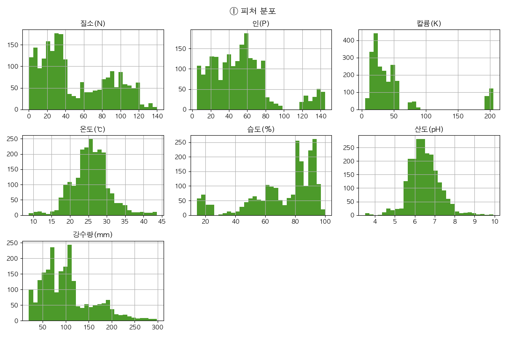
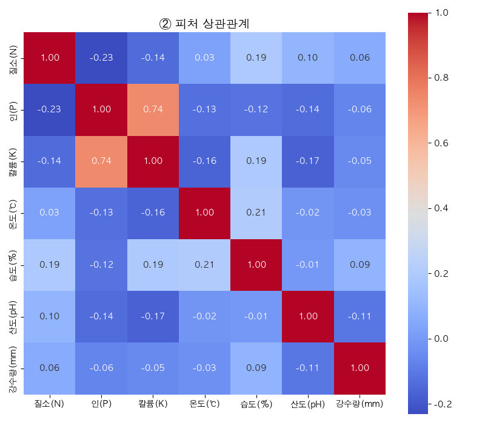
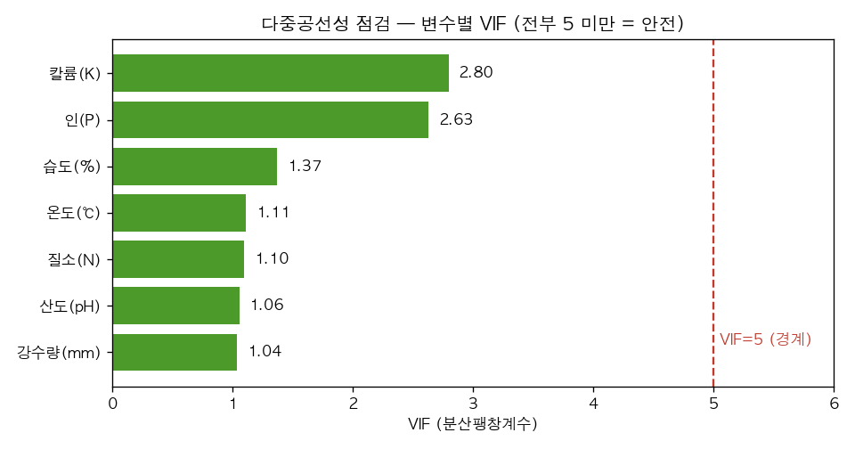
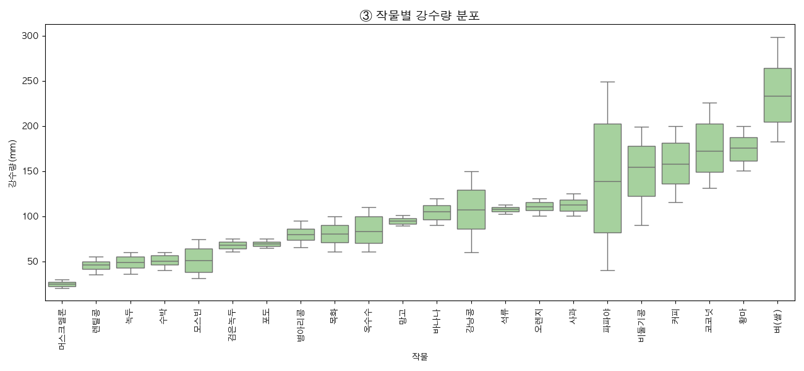
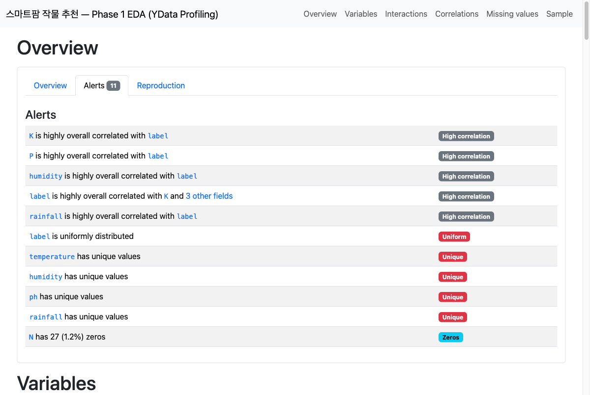
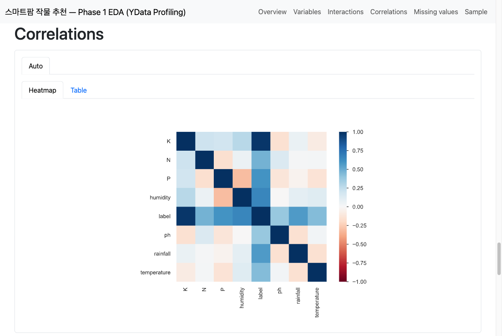
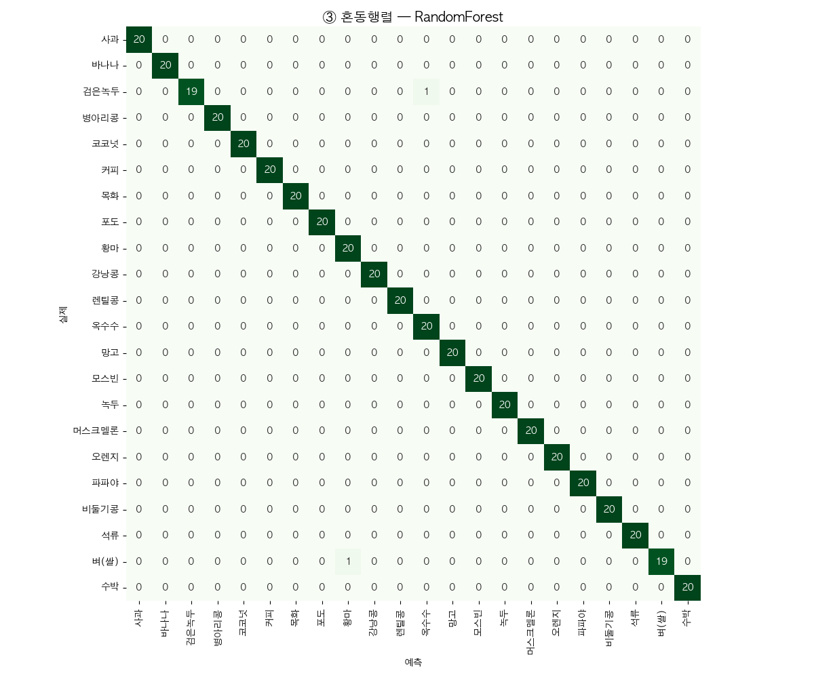
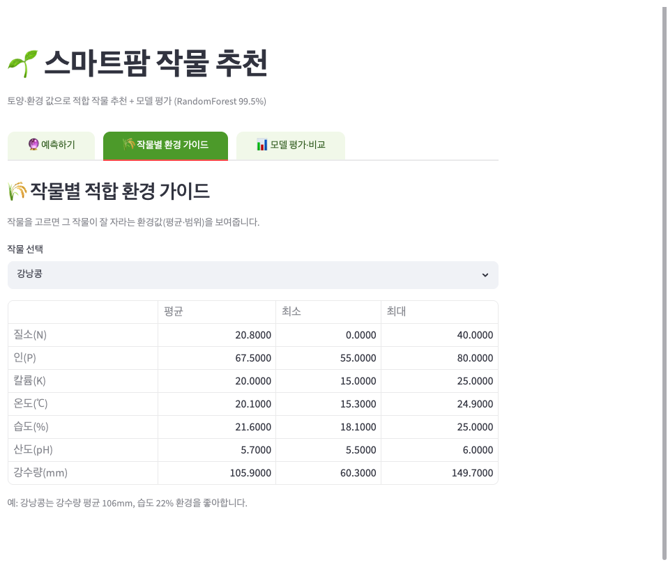
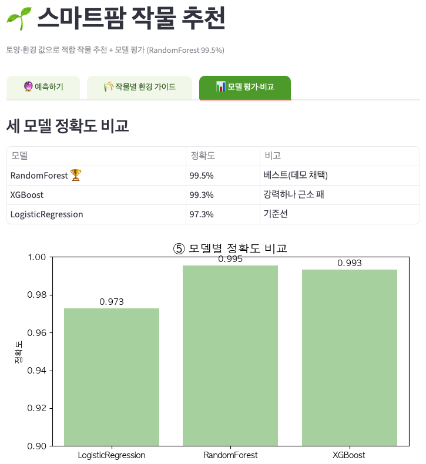

# 📄 AI개발 수행내역서 — Phase 1 (ML)

> **과제: AI 기반 스마트팜 작물 추천 모델 개발 및 시각화**
> 정형 토양·환경 데이터를 학습해 "이 환경에 적합한 작물"을 추천하는 분류 모델 + 웹 데모.

| 항목 | 내용 |
|---|---|
| 과제명 | AI 기반 스마트팜 작물 추천 모델 개발 및 시각화 |
| 담당자 | （작성자） |
| 작성일 | 2026-06-21 |
| 산출물 | 분류 모델(RandomForest, 정확도 99.5%) · Streamlit 데모 · 본 보고서 |
| 코드 | https://github.com/luma200ok/smartfarm_ml_learn |

← [README 허브](../README.md) · 다음 → [phase2_dl.md](phase2_dl.md)

---

## 1. 사업과제

AI 기반 **스마트팜 작물 추천 모델** 개발 및 시각화.
토양 양분·기상 등 정형 데이터로 재배 적합 작물을 자동 판단하여, 현재 "센서값 표시"에 머문 스마트팜 대시보드를 "의사결정 보조"로 확장한다.

## 2. 개요 및 현황

### 2.1 추진배경 및 목적
- 스마트팜 대시보드는 현재 센서값(온습도·토양)만 보여주고, **"무엇을 심어야/어떻게 해야"** 판단은 사람 몫.
- 정형 데이터로 **작물 적합도**를 자동 추천하면, 초보 재배자도 데이터 기반 의사결정이 가능.
- 본 과제는 시범 모델(작물 추천)을 만들고, 향후 **잎 사진 진단(Phase 2 DL)·자연어 처방(Phase 3 LLM)** 으로 확장하기 위한 1단계.

### 2.2 과제 범위
| 구분 | 내용 |
|---|---|
| 모델 | 원시 데이터 수집·전처리 → EDA(상관·분포) → 모델 3종 학습·비교 → 평가(Accuracy/Precision/Recall/F1/혼동행렬) |
| 시각화 | 예측 웹앱 프로토타입(Streamlit) · 모델 평가 시각화 · 테스트 |

### 2.3 과제 추진 방법
```
DATA → 전처리 → 모델링 → 예측 → USER INSIGHT
  │       │        │       │         │
수집   ①결측확인  3종 비교 적합작물  ①웹UI 추천
      ②상관분석  베스트선정  예측   ②평가 시각화
      ③train/test
```

---

## 3. 데이터

### 3.1 데이터 수집
- **Kaggle Crop Recommendation Dataset** — 토양 양분·기상 → 작물 라벨.
- 규모: **2,200행 × 8열** (작물 22종 × 각 100개, 완전 균형).

### 3.2 변수 구성
입력 **7개**(수치형) + 정답 **1개**(범주형) = 8열.

| 구분 | 변수 | 설명 | 범위 |
|---|---|---|---|
| 입력(X) | N | 토양 질소 | 0 ~ 140 |
| 입력(X) | P | 토양 인 | 5 ~ 145 |
| 입력(X) | K | 토양 칼륨 | 5 ~ 205 |
| 입력(X) | temperature | 평균 온도(℃) | 8.8 ~ 43.7 |
| 입력(X) | humidity | 상대 습도(%) | 14.3 ~ 100.0 |
| 입력(X) | ph | 토양 산도 | 3.5 ~ 9.9 |
| 입력(X) | rainfall | 강수량(mm) | 20.2 ~ 298.6 |
| 정답(y) | label | 적합 작물 | 22종 (rice, maize, … coffee) |

### 3.3 판단 결과(종속변수)
- 작물 22종 분류 (다중 분류). 예: rice(벼), maize(옥수수), cotton(목화), coffee(커피) 등.

---

## 4. 탐색적 데이터 분석 (EDA)

### 4.1 데이터 요약
- **결측치 0** (깨끗) · **클래스 완전 균형**(22종 × 100개) → Accuracy를 신뢰 가능.
- 피처 스케일 제각각(rainfall 20~298 vs ph 3.5~9.9) → 스케일링 필요.
- label이 문자(object) → 인코딩 필요.

### 4.2 피처 분포 · 상관관계


- 상관: **P–K = 0.74** (유일하게 뚜렷), 나머지 피처는 거의 독립 → 다중공선성 부담 낮음.
- **VIF(분산팽창계수)로 정량 검증:** 7개 변수 전부 **5 미만**(최대 칼륨 2.80, 인 2.63) → 상관계수 결론과 일치, 다중공선성 안전 → **7개 변수 모두 유지**.


> 💡 **피처 중요도(6.3)와 다른 개념:** VIF는 *입력끼리 겹침*(다중공선성), 중요도는 *예측 기여도*. 예) 강수량은 중요도 1위지만 VIF는 최저(1.04) — 가장 중요하면서 가장 독립적.

### 4.3 작물별 강수량

- 작물마다 강수량이 뚜렷이 다름(muskmelon ~25 ↔ rice ~236) → **피처가 작물을 잘 가름** = 높은 정확도 기대.

### 4.4 자동 EDA 프로파일링 (YData Profiling)


- `ydata-profiling`으로 자동 EDA 리포트를 생성해 수동 EDA(4.1~4.3) 결론을 **교차 검증**.
- 자동 확인: 결측·중복 **0**, 22종 **균등 분포**, label ↔ (K·P·습도·강수량) 강한 연관, N 0값 27건(1.2%, 결측 아님).
- 실행: `python src/ml/profile_report.py` → `reports/phase1_eda_profile.html` (Streamlit 앱 「📑 자동 EDA」 탭에서도 확인).

---

## 5. 데이터 전처리
1. **인코딩** — LabelEncoder로 작물 문자(rice…) → 숫자(0~21).
2. **train/test 분리** — 1,760 / 440 (8:2), `stratify`로 22종 비율 유지.
3. **스케일링** — StandardScaler. **train에만 fit**, test는 transform만 (★데이터 누수 방지).

---

## 6. 모델 정의 및 학습

### 6.1 모델 비교 (베스트 선정)
LogisticRegression → RandomForest → XGBoost 순으로 학습, 동일 train/test로 공정 비교.

| 모델 | Accuracy | 비고 |
|---|---|---|
| LogisticRegression | 97.3% | 기준선(직선 분리) |
| **RandomForest** | **99.5%** | 🏆 **베스트 — 데모 채택** |
| XGBoost | 99.3% | 강력하나 근소 패 |


- **교훈:** 최신·강력 모델(XGBoost)이 항상 1등은 아니다. 데이터가 쉬우면(작물 환경이 뚜렷이 갈림) RandomForest로 이미 천장 → 실제 비교를 통해서만 알 수 있음.

### 6.2 베스트 모델(RandomForest) 평가
- **정확도 99.5%** (440개 중 438개 정답, 오답 2개).
- 약점이던 rice recall이 LogReg 0.80 → RF 0.95로 개선(환경 닮은 rice↔jute 분리).


- 혼동행렬: 대각선=정답. 대각선 밖 오답 거의 없음.

### 6.3 피처 중요도

- **강수량·습도가 1·2위** → "물 관련" 변수가 작물 가르기에 핵심. 4.3 EDA(작물별 강수량 뚜렷)와 정확히 일치.

### 6.4 하이퍼파라미터 튜닝 및 과적합 점검
베이스라인 RF는 **Test 99.5%지만 Train 100%** → 학습 데이터를 완벽히 암기한 **미세한 과적합**. `GridSearchCV`(5-fold, 후보 36조합)로 완화했다.

- **탐색 대상:** `n_estimators`(트리 수) · `max_depth`(최대 깊이) · `min_samples_split` · `min_samples_leaf`
- **최적 조합:** `max_depth=10` · `min_samples_split=5` · `n_estimators=100` · `min_samples_leaf=1`

| 구분 | Train Acc | Test Acc | Gap(과적합 정도) |
|---|---|---|---|
| 튜닝 전 (기본값, 트리 200) | 1.0000 | 0.9955 | +0.0045 |
| **튜닝 후 (GridSearchCV, 트리 100)** | 0.9966 | 0.9955 | **+0.0011** |

- **해석:** Test 정확도는 이미 상한(99.5%)이라 추가 상승은 없었지만, **Train-Test Gap이 0.0045 → 0.0011 (약 76%↓)** 로 과적합이 완화되었고, 트리 200→100·깊이 10 제한으로 모델이 **더 단순·경량**해졌다. 즉 *정확도 유지 + 일반화·효율 개선*의 실익.

### 6.5 평가 신뢰성 검증 — 99.5%를 한 숫자로 믿지 않기
정확도 한 줄로 끝내지 않고, **세 각도로 교차 검증**했다.

**① 베이스라인 대조** — "쉬운 데이터라 당연한 점수"가 아님을 확인

| 기준 | Accuracy |
|---|---|
| 무작위 (DummyClassifier) | 4.5% |
| LogisticRegression | 97.3% |
| **RandomForest** | **99.5%** |

- 22종 완전 균형이라 찍기 = 4.5% → RF는 무작위 대비 약 **20배**. "잘 가른" 모델임이 분명.

**② 5-fold 교차검증** — 단일 분할(99.5%)이 운이 아님을 확인
- CV Accuracy = **99.55% ± 0.25%** (5개 폴드: 99.3 / 99.6 / 100 / 99.6 / 99.3)
- 모든 폴드가 99% 이상 → 99.5%는 **재현되는 실력**.

**③ 오답 분석** — 틀린 2개까지 들여다봄
- `blackgram → maize` · `rice → jute` (둘 다 환경이 닮은 작물 쌍)
- 모델이 헷갈린 건 무작위 실수가 아니라 **실제로 환경이 비슷한 경계 사례** → 납득 가능한 오답.

---

## 7. 프로토타이핑 (Streamlit)

`app.py` — 학습된 모델(`models/phase1_crop_rf.pkl`)을 불러와 예측 서비스 (4개 탭).

| 탭 | 기능 |
|---|---|
| 🔮 예측하기 | 슬라이더 7개로 환경값 입력 → 추천 작물 + 신뢰도 Top3 + 추천 이유 |
| 🌾 작물별 환경 가이드 | 작물 선택 → 적합 환경값(평균·최소·최대) 표 |
| 📊 모델 평가·비교 | 정확도 비교표 · 혼동행렬 · 피처 중요도 시각화 |
| 📑 자동 EDA 리포트 | `ydata-profiling` 리포트 임베드 |


*🔮 탭1 · 예측하기 — 환경값 입력 → 추천 작물 + 신뢰도 Top3*


*🌾 탭2 · 작물별 환경 가이드 — 작물 선택 → 적합 환경값(평균·최소·최대)*


*📊 탭3 · 모델 평가·비교 — 3종 정확도 + 평가 시각화*

- **학습 ↔ 서빙 분리:** 학습은 미리 1번(→.pkl), 앱은 불러와 예측만(`transform`만, 재학습 X).
- 실행: `streamlit run app.py`
- 🔗 라이브 데모: https://smartfarm-ai-learn.streamlit.app/ (Streamlit Community Cloud 배포)

---

## 8. 결론 및 제안
- **성과:** 정형 데이터만으로 작물 22종을 **99.5%** 정확도로 추천하는 모델 + 웹 데모 완성.
- **한계:** Kaggle 공개 데이터(이상적). 실서비스엔 국내 실측 데이터(스마트팜코리아) 보강 필요.
- **확장 방향:**
  - **Phase 2 (DL):** 잎 사진 → CNN 병해충 진단 (정형 ML로 불가능한 새 능력).
  - **Phase 3 (LLM):** 진단·환경 예측 + 재배지식(RAG) → 자연어 처방 + 알림.

---

## 📌 배운점 (회고)
- ML 5단계 골격(준비→학습→예측→평가→시각화). 모델만 바꿔 끼우면 흐름 동일.
- 평가는 3겹(Accuracy → classification_report → 혼동행렬). 한 숫자만 믿지 말 것.
- 모델 선택은 "최신=최강"이 아니라 **데이터 보고 실제 비교**.
- 학습과 서빙(배포)은 다른 일 — 모델을 파일로 저장해 불러 쓰는 패턴.
